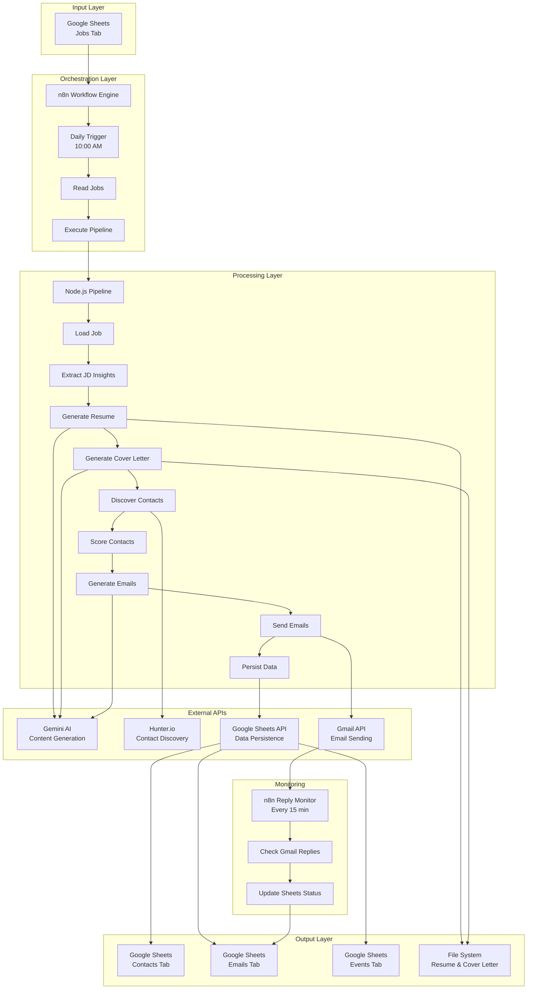
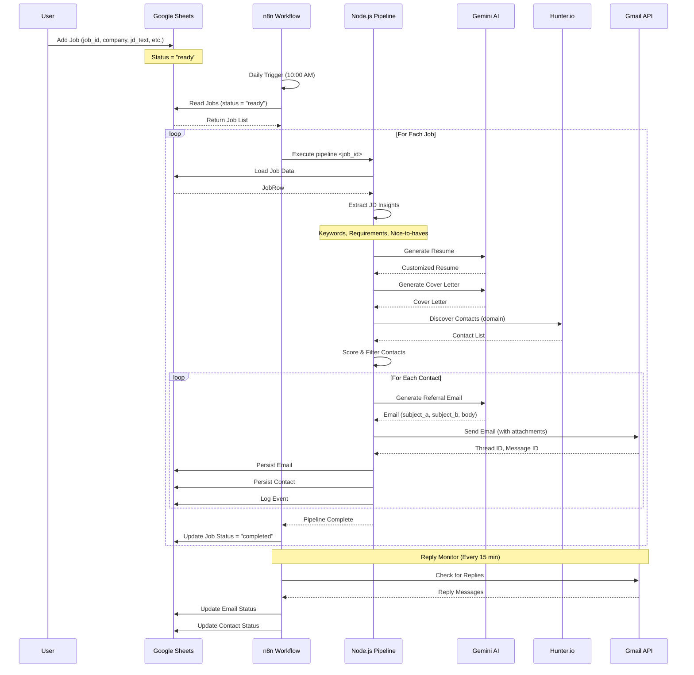
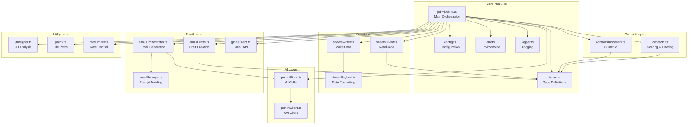
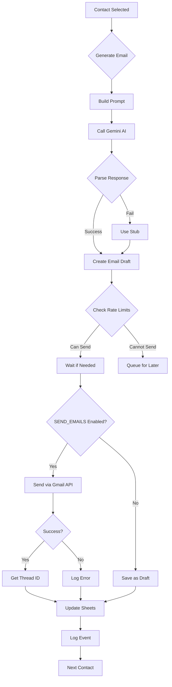
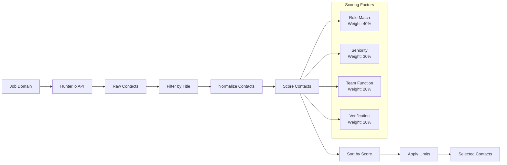
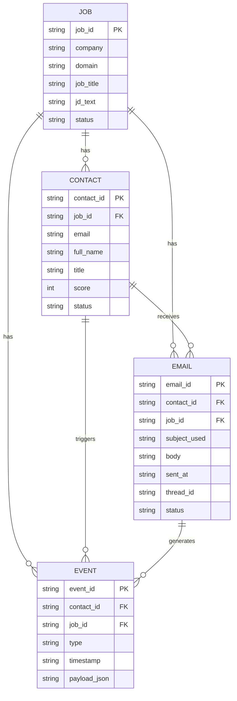
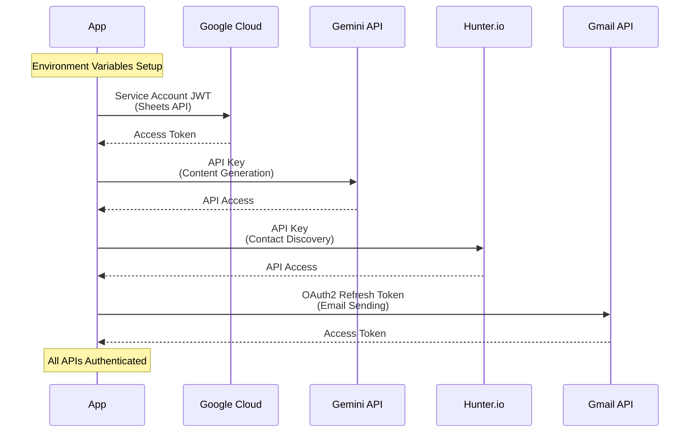
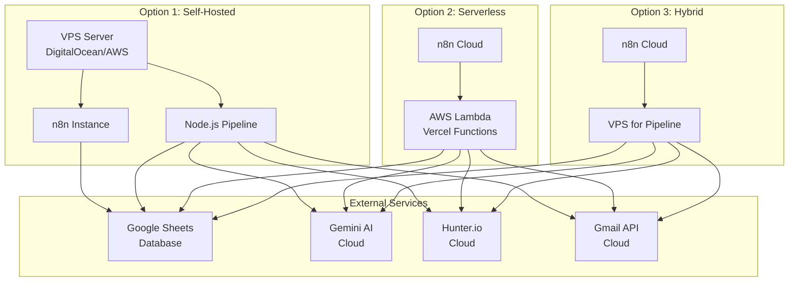
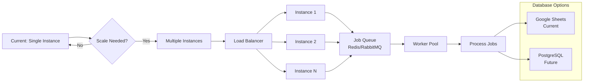
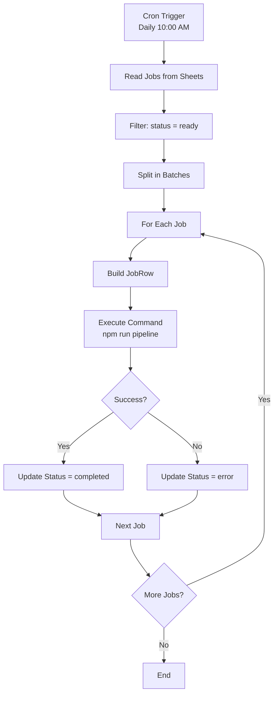

# ReferrAI - Architecture Diagrams

## 📊 System Architecture Overview

### High-Level Architecture

---

## 🔄 Complete Data Flow

### End-to-End Pipeline Flow

---

## 🏗️ Component Architecture

### Module Dependencies

---

## 📧 Email Sending Flow

### Detailed Email Pipeline

---

## 🔍 Contact Discovery & Scoring

### Contact Processing Pipeline

---

## 📊 Data Model

### Entity Relationship Diagram

---

## 🔐 Authentication Flow

### OAuth2 & API Key Flow

---

## 🚀 Deployment Architecture

### Production Setup Options

---

## 📈 Scalability Architecture

### Scaling Strategy

---

## 🔄 n8n Workflow Structure

### Main Workflow Nodes

---

## 📝 Summary

These diagrams show:

1. **High-Level Architecture** - Overall system structure
2. **Data Flow** - How data moves through the system
3. **Component Dependencies** - Module relationships
4. **Email Pipeline** - Detailed email sending flow
5. **Contact Processing** - Discovery and scoring
6. **Data Model** - Entity relationships
7. **Authentication** - API access patterns
8. **Deployment Options** - Production setups
9. **Scaling Strategy** - Growth path
10. **n8n Workflow** - Orchestration structure

All diagrams use **Mermaid** syntax and can be rendered in:
- GitHub (native support)
- Markdown viewers
- Documentation sites
- Mermaid Live Editor

