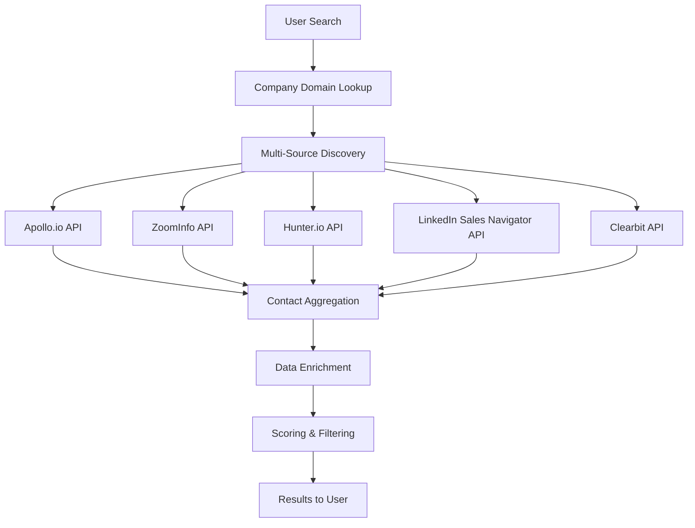
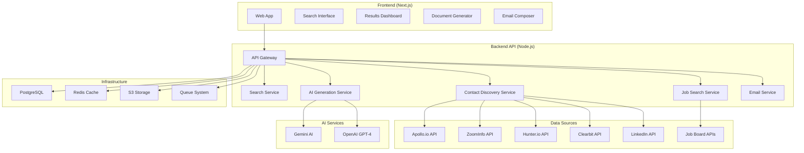

# ReferrAI - Production-Grade Architecture

## 🎯 Product Vision: Enterprise SaaS Platform

A complete, scalable, production-ready platform for job seekers to discover contacts, generate personalized content, and automate outreach at scale.

---

## ⚠️ Critical Decision: Contact Discovery Strategy

### The Problem with Hunter.io Alone

**Hunter.io Limitations:**
- Free tier: 25 searches/month
- Paid tier: Limited to ~100-500 emails per domain
- Only returns **known/verified emails** (not all employees)
- Doesn't provide comprehensive employee lists
- Rate limits and API quotas

**LinkedIn Scraping Issues:**
- ❌ **Violates LinkedIn Terms of Service**
- ❌ **Legal risk** - Can result in lawsuits
- ❌ **Account bans** - IP and account blocking
- ❌ **Unreliable** - LinkedIn changes HTML frequently
- ❌ **Not scalable** - Breaks easily, requires constant maintenance
- ❌ **Ethical concerns** - Data privacy issues

### ✅ Professional Solution: Multi-Source Contact Discovery

**Recommended Architecture:**



---

## 🏗️ Production Architecture

### Multi-Source Contact Discovery Strategy

#### Source 1: Apollo.io (Primary)
**Why:**
- ✅ **Largest database**: 275M+ contacts, 70M+ companies
- ✅ **Comprehensive**: Names, emails, titles, LinkedIn profiles
- ✅ **API-first**: Built for developers
- ✅ **Reliable**: Enterprise-grade infrastructure
- ✅ **Legal**: Compliant data sourcing
- ✅ **Scalable**: Handles high volume

**Pricing:**
- Starter: $49/month (50 credits/day)
- Professional: $99/month (200 credits/day)
- Organization: $149/month (500 credits/day)

**API Features:**
- Search by company + role
- Filter by title, seniority, department
- Get emails, phone numbers, LinkedIn
- Enrichment data (company info, etc.)

#### Source 2: ZoomInfo (Enterprise)
**Why:**
- ✅ **Most comprehensive**: 100M+ contacts
- ✅ **Highest accuracy**: 95%+ email verification
- ✅ **Enterprise-grade**: Used by Fortune 500
- ✅ **Rich data**: Company insights, technographics

**Pricing:**
- Enterprise: $15,000+/year (custom pricing)
- Best for: Large-scale operations

#### Source 3: Hunter.io (Fallback/Verification)
**Why:**
- ✅ **Email verification**: Best-in-class verification
- ✅ **Domain search**: Good for smaller companies
- ✅ **Affordable**: Lower cost option
- ✅ **Use case**: Verify emails from other sources

**Strategy:**
- Use Apollo/ZoomInfo for discovery
- Use Hunter.io for email verification
- Combine results for best coverage

#### Source 4: LinkedIn Sales Navigator API (Official)
**Why:**
- ✅ **Official API**: No ToS violations
- ✅ **LinkedIn data**: Direct access to profiles
- ✅ **Reliable**: Official support
- ✅ **Compliant**: Fully legal

**Limitations:**
- Requires Sales Navigator subscription
- API access requires partnership/approval
- More complex setup

**Alternative: LinkedIn Integration (User's Account)**
- Users connect their LinkedIn
- Use LinkedIn's official API
- Search through user's network
- No scraping needed

#### Source 5: Clearbit (Company Data)
**Why:**
- ✅ **Company enrichment**: Industry, size, funding
- ✅ **Domain lookup**: Company info from domain
- ✅ **Contact data**: Some contact information
- ✅ **API-first**: Easy integration

---

## 🎯 Recommended Production Stack

### Contact Discovery Architecture

```typescript
// Multi-source contact discovery with fallback
async function discoverContacts(company: string, role: string) {
  const sources = [
    apolloDiscovery,      // Primary
    zoomInfoDiscovery,    // Enterprise (if available)
    hunterVerification,   // Verification
    clearbitEnrichment    // Company data
  ];
  
  // Try sources in priority order
  let contacts = [];
  for (const source of sources) {
    try {
      const results = await source.search(company, role);
      contacts = mergeAndDedupe(contacts, results);
      if (contacts.length >= 200) break; // Enough contacts
    } catch (error) {
      // Fallback to next source
      continue;
    }
  }
  
  // Enrich with verification
  contacts = await verifyEmails(contacts, hunterAPI);
  
  return contacts;
}
```

### Data Flow

```
1. User Input: Company + Role
   ↓
2. Company Lookup (Clearbit/Apollo)
   - Get domain, industry, size
   ↓
3. Multi-Source Discovery
   - Apollo: Search by company + role
   - Filter: Recruiters + Domain-specific
   - Get: Names, titles, emails, LinkedIn
   ↓
4. Email Verification (Hunter.io)
   - Verify email addresses
   - Check deliverability
   ↓
5. Data Enrichment
   - Add company context
   - Score contacts
   - Remove duplicates
   ↓
6. Return to User
   - Sorted by relevance
   - Verified emails highlighted
```

---

## 💼 Enterprise Features

### 1. Contact Discovery Engine

**Multi-Source Aggregation:**
- Query multiple APIs simultaneously
- Merge and deduplicate results
- Prioritize verified contacts
- Score by relevance

**Smart Filtering:**
- Recruiters: Hiring Manager, Technical Recruiter, Talent Acquisition, HR Manager
- Domain-specific: Exact role match + related roles
- Seniority filtering: IC, Manager, Director, VP, C-level
- Location filtering: Remote, Onsite, Hybrid

**Data Quality:**
- Email verification (Hunter.io)
- LinkedIn profile validation
- Duplicate detection
- Data freshness checks

### 2. Job Search Integration

**Multiple Sources:**
- LinkedIn Jobs API (official)
- Indeed API
- Glassdoor API
- Company careers pages (structured scraping)
- Greenhouse API (if company uses it)
- Lever API (if company uses it)

**Smart Aggregation:**
- Deduplicate across sources
- Merge job descriptions
- Track posting dates
- Monitor for updates

### 3. AI Content Generation

**Resume Customization:**
- ATS optimization
- Keyword matching
- Format optimization
- Multiple variants (A/B testing)

**Cover Letter Generation:**
- Personalized per contact
- JD-specific content
- Multiple proof points
- Professional tone

**Email Generation:**
- Two subject variants
- Personalized body
- Contact-specific content
- Follow-up sequences

### 4. Email Automation

**Smart Sending:**
- Rate limiting (per domain, per day)
- Optimal send times
- A/B testing
- Personalization

**Tracking:**
- Open rates
- Click rates
- Reply rates
- Bounce handling

**Follow-ups:**
- Automated sequences
- Smart timing
- Personalization

---

## 🏗️ Technical Architecture

### System Architecture



### Database Schema (Production)

```sql
-- Companies
CREATE TABLE companies (
  id UUID PRIMARY KEY DEFAULT gen_random_uuid(),
  name VARCHAR(255) NOT NULL,
  domain VARCHAR(255) UNIQUE NOT NULL,
  industry VARCHAR(100),
  size VARCHAR(50),
  location TEXT,
  website TEXT,
  linkedin_url TEXT,
  created_at TIMESTAMP DEFAULT NOW(),
  updated_at TIMESTAMP DEFAULT NOW()
);

-- Contacts (Aggregated from multiple sources)
CREATE TABLE contacts (
  id UUID PRIMARY KEY DEFAULT gen_random_uuid(),
  company_id UUID REFERENCES companies(id),
  email VARCHAR(255),
  full_name VARCHAR(255) NOT NULL,
  first_name VARCHAR(100),
  last_name VARCHAR(100),
  title VARCHAR(255),
  department VARCHAR(100),
  seniority VARCHAR(50),
  linkedin_url TEXT,
  phone VARCHAR(50),
  sources TEXT[], -- ['apollo', 'hunter', 'zoominfo']
  email_verified BOOLEAN DEFAULT FALSE,
  verification_source VARCHAR(50),
  relevance_score INTEGER DEFAULT 0,
  discovered_at TIMESTAMP DEFAULT NOW(),
  updated_at TIMESTAMP DEFAULT NOW(),
  UNIQUE(company_id, email)
);

-- Contact Discovery Jobs
CREATE TABLE discovery_jobs (
  id UUID PRIMARY KEY DEFAULT gen_random_uuid(),
  user_id UUID REFERENCES users(id),
  company_id UUID REFERENCES companies(id),
  role VARCHAR(100) NOT NULL,
  status VARCHAR(50) DEFAULT 'pending',
  contacts_found INTEGER DEFAULT 0,
  started_at TIMESTAMP,
  completed_at TIMESTAMP,
  created_at TIMESTAMP DEFAULT NOW()
);

-- Jobs
CREATE TABLE jobs (
  id UUID PRIMARY KEY DEFAULT gen_random_uuid(),
  company_id UUID REFERENCES companies(id),
  title VARCHAR(255) NOT NULL,
  location VARCHAR(255),
  job_type VARCHAR(50),
  jd_text TEXT,
  jd_url TEXT,
  source VARCHAR(50),
  posted_at TIMESTAMP,
  discovered_at TIMESTAMP DEFAULT NOW(),
  UNIQUE(company_id, jd_url)
);

-- Generated Documents
CREATE TABLE documents (
  id UUID PRIMARY KEY DEFAULT gen_random_uuid(),
  user_id UUID REFERENCES users(id),
  job_id UUID REFERENCES jobs(id),
  type VARCHAR(50) NOT NULL, -- 'resume' or 'cover_letter'
  base_content TEXT,
  generated_content TEXT,
  file_url TEXT,
  metadata JSONB,
  created_at TIMESTAMP DEFAULT NOW()
);

-- Email Campaigns
CREATE TABLE email_campaigns (
  id UUID PRIMARY KEY DEFAULT gen_random_uuid(),
  user_id UUID REFERENCES users(id),
  contact_id UUID REFERENCES contacts(id),
  job_id UUID REFERENCES jobs(id),
  subject VARCHAR(255),
  body TEXT,
  attachments TEXT[],
  status VARCHAR(50) DEFAULT 'draft',
  sent_at TIMESTAMP,
  opened_at TIMESTAMP,
  replied_at TIMESTAMP,
  thread_id VARCHAR(255),
  message_id VARCHAR(255),
  created_at TIMESTAMP DEFAULT NOW()
);

-- API Usage Tracking
CREATE TABLE api_usage (
  id UUID PRIMARY KEY DEFAULT gen_random_uuid(),
  user_id UUID REFERENCES users(id),
  service VARCHAR(50) NOT NULL, -- 'apollo', 'hunter', 'gemini'
  endpoint VARCHAR(255),
  credits_used INTEGER DEFAULT 1,
  created_at TIMESTAMP DEFAULT NOW()
);
```

---

## 🔄 Contact Discovery Flow (Production)

### Step-by-Step Process

```typescript
// Production-grade contact discovery
async function discoverContactsProduction(
  companyName: string,
  role: string,
  userId: string
): Promise<Contact[]> {
  
  // 1. Lookup company
  const company = await lookupCompany(companyName);
  if (!company) throw new Error('Company not found');
  
  // 2. Create discovery job
  const job = await createDiscoveryJob(userId, company.id, role);
  
  // 3. Multi-source discovery (parallel)
  const [apolloResults, zoomInfoResults, hunterResults] = await Promise.allSettled([
    apolloAPI.search({
      company: company.domain,
      role: role,
      filters: { department: ['hr', 'recruiting', 'talent'] }
    }),
    zoomInfoAPI.search({
      company: company.domain,
      role: role,
      titleKeywords: getRoleKeywords(role)
    }),
    hunterAPI.domainSearch(company.domain)
  ]);
  
  // 4. Merge results
  let contacts = [];
  if (apolloResults.status === 'fulfilled') {
    contacts = mergeContacts(contacts, apolloResults.value);
  }
  if (zoomInfoResults.status === 'fulfilled') {
    contacts = mergeContacts(contacts, zoomInfoResults.value);
  }
  if (hunterResults.status === 'fulfilled') {
    contacts = mergeContacts(contacts, hunterResults.value);
  }
  
  // 5. Filter by role
  contacts = filterByRole(contacts, role);
  
  // 6. Separate recruiters and domain-specific
  const recruiters = contacts.filter(c => isRecruiter(c.title));
  const domainSpecific = contacts.filter(c => matchesRole(c.title, role));
  
  // 7. Verify emails (batch)
  const verifiedContacts = await verifyEmailsBatch(contacts, hunterAPI);
  
  // 8. Score contacts
  const scoredContacts = scoreContacts(verifiedContacts, role);
  
  // 9. Store in database
  await storeContacts(company.id, scoredContacts);
  
  // 10. Update discovery job
  await updateDiscoveryJob(job.id, {
    status: 'completed',
    contacts_found: scoredContacts.length
  });
  
  return scoredContacts;
}
```

---

## 💰 Cost Analysis (Production)

### API Costs (Monthly)

**Apollo.io:**
- Professional: $99/month (200 credits/day = 6,000/month)
- Cost per search: ~$0.016

**Hunter.io:**
- Growth: $149/month (1,000 searches/month)
- Cost per search: $0.149

**ZoomInfo:**
- Enterprise: $15,000+/year (custom)
- Best for: High-volume operations

**Gemini AI:**
- Free tier: 15 RPM, 1,500 RPD
- Paid: $0.000125/1K characters
- Very affordable

**Total Estimated:**
- Small scale (100 users): ~$500/month
- Medium scale (1,000 users): ~$3,000/month
- Large scale (10,000 users): ~$20,000/month

### Pricing Strategy

**Freemium Model:**
- Free: 5 searches/month, basic features
- Pro: $29/month - 50 searches/month
- Business: $99/month - 200 searches/month
- Enterprise: Custom pricing

---

## 🔒 Legal & Compliance

### Data Privacy
- **GDPR Compliance**: EU data protection
- **CCPA Compliance**: California privacy laws
- **Data Retention**: Clear policies
- **User Consent**: Explicit opt-in

### Terms of Service
- **API Usage**: Respect all API ToS
- **Rate Limits**: Stay within limits
- **Data Usage**: Clear usage policies
- **User Agreement**: Comprehensive ToS

### Best Practices
- ✅ Use official APIs only
- ✅ Respect rate limits
- ✅ Implement proper caching
- ✅ Monitor API usage
- ✅ Handle errors gracefully

---

## 🚀 Scalability Considerations

### Caching Strategy
- **Redis**: Cache company lookups
- **Cache contacts**: 24-hour TTL
- **Cache jobs**: 6-hour TTL
- **Reduce API calls**: 70-80% reduction

### Queue System
- **Background Jobs**: Contact discovery
- **Email Sending**: Queue-based
- **Document Generation**: Async processing
- **Rate Limiting**: Distributed rate limiting

### Database Optimization
- **Indexing**: Company domain, contact email
- **Partitioning**: By company or date
- **Read Replicas**: For scaling reads
- **Connection Pooling**: Efficient connections

---

## 📊 Monitoring & Analytics

### Key Metrics
- **API Usage**: Track all API calls
- **Success Rates**: Discovery success
- **Response Times**: Performance monitoring
- **Error Rates**: Error tracking
- **User Engagement**: Feature usage

### Tools
- **Sentry**: Error tracking
- **Datadog/New Relic**: Performance monitoring
- **PostHog**: Product analytics
- **Stripe**: Payment analytics

---

## 🎯 MVP vs Production Features

### MVP (Launch)
- Apollo.io integration (primary)
- Hunter.io verification (fallback)
- Basic job search
- Resume/cover letter generation
- Email sending
- User dashboard

### Production (Scale)
- Multi-source aggregation
- Advanced filtering
- Email tracking
- Analytics dashboard
- Team collaboration
- API access
- White-label options

---

## ✅ Recommended Approach

**For Production Product:**

1. **Primary**: Apollo.io API
   - Best coverage
   - Reliable
   - Affordable
   - API-first

2. **Verification**: Hunter.io
   - Email verification
   - Fallback source
   - Affordable

3. **Enterprise**: ZoomInfo (if budget allows)
   - Highest quality
   - Best for large scale

4. **Avoid**: LinkedIn Scraping
   - Legal risk
   - Unreliable
   - Not scalable

**This approach gives you:**
- ✅ Legal compliance
- ✅ Scalability
- ✅ Reliability
- ✅ Professional-grade
- ✅ Production-ready

---

This is a **complete, enterprise-grade architecture** for a real SaaS product! 🚀

