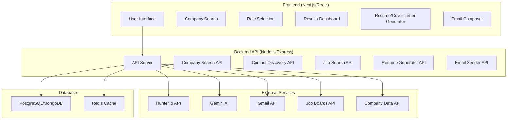
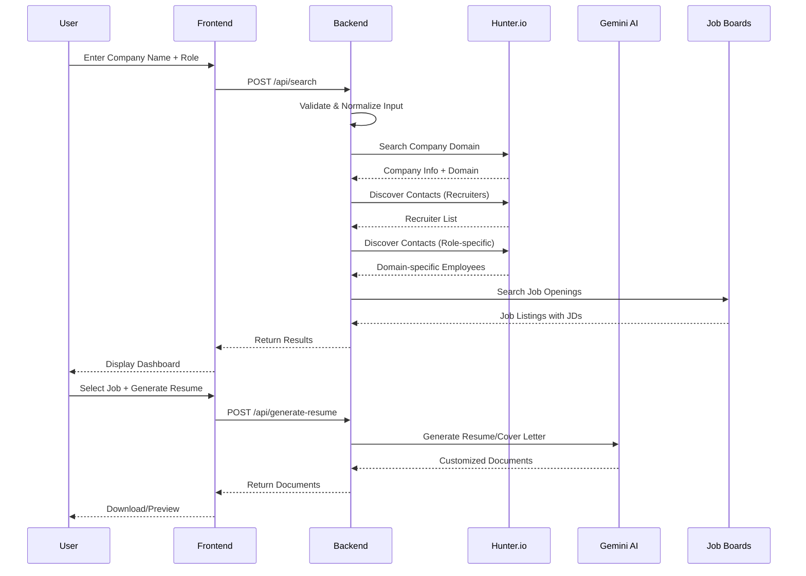

# ReferrAI Website - Production Architecture

## 🎯 Product Vision

A production-level web application where users can:
1. **Search** for companies and job roles
2. **Discover** contacts (recruiters + domain-specific employees)
3. **View** job openings with JDs
4. **Generate** customized resumes and cover letters
5. **Send** referral emails automatically

---

## 🏗️ Architecture Overview

### Frontend + Backend Architecture



---

## 🎨 User Flow

### Main User Journey



---

## 📋 Feature Set

### Core Features

1. **Company & Role Search**
   - Company name input (autocomplete)
   - Role/domain selection (dropdown or autocomplete)
   - Real-time validation
   - Company verification

2. **Contact Discovery Dashboard**
   - **Recruiters Section:**
     - Hiring Managers
     - Technical Recruiters
     - Talent Acquisition Specialists
     - HR Managers
   - **Domain-Specific Employees:**
     - People working in the selected role
     - Filtered by job title keywords
   - Contact cards with:
     - Name, Title, Email
     - LinkedIn profile
     - Verification status
     - Relevance score

3. **Job Openings Integration**
   - Search job boards (LinkedIn, Indeed, company careers page)
   - Display job listings with:
     - Job title
     - Location
     - Full job description
     - Application link
   - Filter by role/domain

4. **Resume & Cover Letter Generator**
   - Upload base resume (PDF/DOCX)
   - Auto-generate customized versions:
     - Tailored to specific job
     - Keyword optimization
     - ATS-friendly format
   - Preview before download
   - Multiple format options (PDF, DOCX, LaTeX)

5. **Email Composer & Sender**
   - Select contacts to email
   - AI-generated email drafts
   - Customize before sending
   - Schedule sending
   - Track email status

### Advanced Features

6. **User Dashboard**
   - Saved searches
   - Generated documents history
   - Email tracking
   - Contact management
   - Analytics (response rates, etc.)

7. **AI-Powered Features**
   - Smart contact scoring
   - Email personalization
   - Resume optimization suggestions
   - Interview preparation tips

8. **Integration Features**
   - LinkedIn integration (import profile)
   - Calendar integration (schedule follow-ups)
   - Email tracking (open rates, replies)
   - CRM-like contact management

9. **Collaboration Features**
   - Share contacts with team
   - Team workspaces
   - Shared document library

10. **Premium Features**
    - Unlimited searches
    - Advanced filters
    - Priority support
    - API access
    - White-label options

---

## 🛠️ Technology Stack

### Frontend
- **Framework**: Next.js 14+ (React)
- **Styling**: Tailwind CSS + shadcn/ui
- **State Management**: Zustand or React Query
- **Forms**: React Hook Form + Zod validation
- **Charts**: Recharts or Chart.js
- **UI Components**: shadcn/ui or MUI

### Backend
- **Runtime**: Node.js 18+
- **Framework**: Express.js or Fastify
- **API**: RESTful API + GraphQL (optional)
- **Authentication**: NextAuth.js or Auth0
- **Rate Limiting**: express-rate-limit
- **Validation**: Zod

### Database
- **Primary**: PostgreSQL (via Prisma ORM)
- **Cache**: Redis
- **File Storage**: AWS S3 or Cloudinary

### External APIs
- **Contact Discovery**: Hunter.io
- **AI Generation**: Gemini AI
- **Email Sending**: Gmail API / SendGrid
- **Job Search**: LinkedIn API, Indeed API, or web scraping
- **Company Data**: Clearbit API or similar

### Infrastructure
- **Hosting**: Vercel (Frontend) + Railway/Render (Backend)
- **Database**: Supabase or Neon (PostgreSQL)
- **CDN**: Cloudflare
- **Monitoring**: Sentry
- **Analytics**: PostHog or Mixpanel

---

## 📐 Database Schema

### Core Tables

```sql
-- Users
CREATE TABLE users (
  id UUID PRIMARY KEY,
  email VARCHAR(255) UNIQUE,
  name VARCHAR(255),
  created_at TIMESTAMP,
  subscription_tier VARCHAR(50)
);

-- Companies
CREATE TABLE companies (
  id UUID PRIMARY KEY,
  name VARCHAR(255),
  domain VARCHAR(255) UNIQUE,
  industry VARCHAR(100),
  created_at TIMESTAMP
);

-- Searches
CREATE TABLE searches (
  id UUID PRIMARY KEY,
  user_id UUID REFERENCES users(id),
  company_id UUID REFERENCES companies(id),
  role VARCHAR(100),
  created_at TIMESTAMP
);

-- Contacts
CREATE TABLE contacts (
  id UUID PRIMARY KEY,
  company_id UUID REFERENCES companies(id),
  email VARCHAR(255),
  full_name VARCHAR(255),
  title VARCHAR(255),
  linkedin_url TEXT,
  source VARCHAR(50),
  verified BOOLEAN,
  discovered_at TIMESTAMP
);

-- Jobs
CREATE TABLE jobs (
  id UUID PRIMARY KEY,
  company_id UUID REFERENCES companies(id),
  title VARCHAR(255),
  location VARCHAR(255),
  jd_text TEXT,
  url TEXT,
  posted_at TIMESTAMP,
  discovered_at TIMESTAMP
);

-- Generated Documents
CREATE TABLE documents (
  id UUID PRIMARY KEY,
  user_id UUID REFERENCES users(id),
  job_id UUID REFERENCES jobs(id),
  type VARCHAR(50), -- 'resume' or 'cover_letter'
  content TEXT,
  file_url TEXT,
  created_at TIMESTAMP
);

-- Email Campaigns
CREATE TABLE email_campaigns (
  id UUID PRIMARY KEY,
  user_id UUID REFERENCES users(id),
  contact_id UUID REFERENCES contacts(id),
  job_id UUID REFERENCES jobs(id),
  subject VARCHAR(255),
  body TEXT,
  status VARCHAR(50),
  sent_at TIMESTAMP,
  thread_id VARCHAR(255)
);
```

---

## 🎯 API Endpoints

### Search & Discovery

```
POST   /api/search
  Body: { company: string, role: string }
  Returns: { company, contacts, jobs }

GET    /api/contacts/:companyId
  Query: ?role=datascientist&type=recruiter
  Returns: Contact[]

GET    /api/jobs/:companyId
  Query: ?role=datascientist
  Returns: Job[]
```

### Document Generation

```
POST   /api/generate/resume
  Body: { jobId, baseResume, userId }
  Returns: { resumeUrl, resumeText }

POST   /api/generate/cover-letter
  Body: { jobId, userId, proofPoints }
  Returns: { coverLetterUrl, coverLetterText }
```

### Email Management

```
POST   /api/emails/compose
  Body: { contactIds[], jobId, variant }
  Returns: { drafts[] }

POST   /api/emails/send
  Body: { emailId, attachments[] }
  Returns: { threadId, messageId }

GET    /api/emails/status/:emailId
  Returns: { status, opened, replied }
```

### User Management

```
GET    /api/user/dashboard
  Returns: { searches, documents, campaigns }

POST   /api/user/save-search
  Body: { companyId, role }
  Returns: { savedSearchId }
```

---

## 🎨 UI/UX Design

### Pages

1. **Landing Page**
   - Hero section with value proposition
   - Search bar (company + role)
   - Features showcase
   - Pricing (if applicable)

2. **Search Results Dashboard**
   - Company info card
   - Tabs: Recruiters | Domain Employees | Jobs
   - Filters and sorting
   - Export options

3. **Contact Detail View**
   - Full contact card
   - LinkedIn profile preview
   - Email history
   - Notes

4. **Job Detail View**
   - Full job description
   - Company info
   - Generate resume/cover letter CTA
   - Apply button

5. **Document Generator**
   - Upload base resume
   - Preview generated version
   - Download options
   - Edit before download

6. **Email Composer**
   - Contact selection
   - Email preview
   - AI suggestions
   - Send/schedule options

7. **User Dashboard**
   - Recent searches
   - Saved contacts
   - Generated documents
   - Email campaigns
   - Analytics

---

## 🚀 Implementation Plan

### Phase 1: MVP (4-6 weeks)
- [ ] Basic search (company + role)
- [ ] Contact discovery (Hunter.io)
- [ ] Results display
- [ ] Basic resume generation
- [ ] User authentication

### Phase 2: Core Features (4-6 weeks)
- [ ] Job search integration
- [ ] Cover letter generation
- [ ] Email composer
- [ ] Document download
- [ ] User dashboard

### Phase 3: Advanced Features (4-6 weeks)
- [ ] Email sending
- [ ] Email tracking
- [ ] Advanced filters
- [ ] Analytics
- [ ] Saved searches

### Phase 4: Polish & Scale (2-4 weeks)
- [ ] Performance optimization
- [ ] Mobile responsive
- [ ] Error handling
- [ ] Documentation
- [ ] Testing

---

## 💡 Additional Feature Ideas

1. **Smart Recommendations**
   - Suggest similar companies
   - Recommend related roles
   - Suggest best contacts to reach out to

2. **A/B Testing**
   - Test different email subject lines
   - Test different resume formats
   - Track which performs better

3. **Integration Hub**
   - Import from LinkedIn
   - Export to CSV
   - Connect to CRM (HubSpot, Salesforce)

4. **Team Features**
   - Shared workspace
   - Team analytics
   - Role-based permissions

5. **AI Assistant**
   - Chat interface
   - Answer questions about companies
   - Suggest next steps

6. **Marketplace**
   - Share resume templates
   - Community-contributed content
   - Expert reviews

7. **Learning Center**
   - Job search tips
   - Resume writing guides
   - Interview prep resources

---

## 📊 Success Metrics

- **User Engagement**: Daily active users, searches per user
- **Conversion**: Resume generations, emails sent
- **Quality**: Contact discovery accuracy, email response rates
- **Performance**: Page load times, API response times
- **Retention**: User return rate, subscription conversions

---

## 🔒 Security & Privacy

- **Authentication**: Secure JWT tokens
- **Data Encryption**: HTTPS, encrypted database
- **Rate Limiting**: Prevent abuse
- **GDPR Compliance**: User data privacy
- **API Security**: API keys, rate limits
- **Input Validation**: Prevent injection attacks

---

## 💰 Monetization Options

1. **Freemium Model**
   - Free: 5 searches/month, basic features
   - Pro: Unlimited searches, advanced features ($29/month)
   - Enterprise: Team features, API access (custom pricing)

2. **Pay-per-Use**
   - Credits system
   - Buy credits for searches/generations

3. **Subscription Tiers**
   - Basic, Pro, Enterprise
   - Different feature sets

---

## 🎯 Next Steps

1. **Design Mockups** - Create UI/UX designs
2. **Set Up Project** - Initialize Next.js + Backend
3. **Build MVP** - Start with basic search
4. **Integrate APIs** - Connect Hunter.io, Gemini
5. **Add Features** - Iteratively add functionality
6. **Test & Deploy** - Comprehensive testing, then launch

---

This is a comprehensive plan for building a production-level website! 🚀

